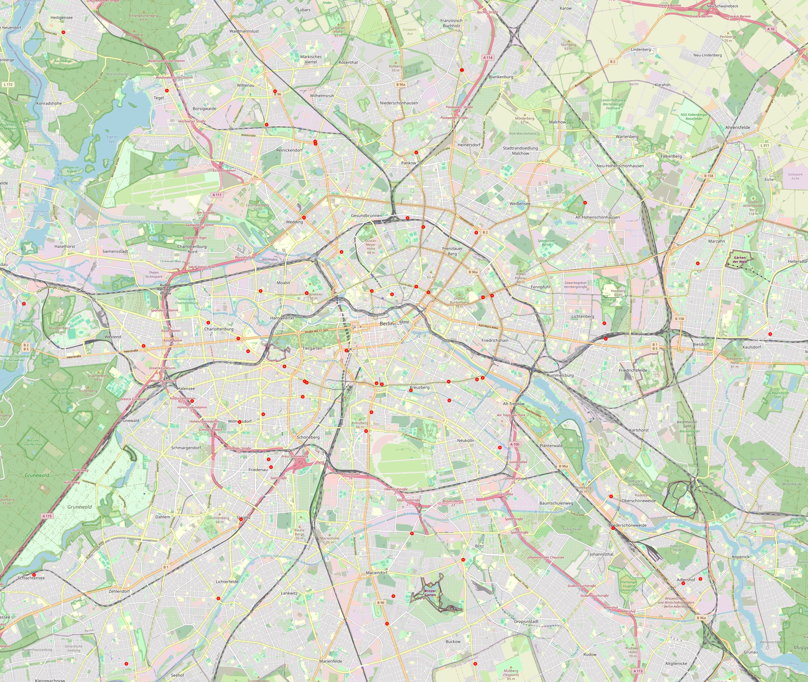
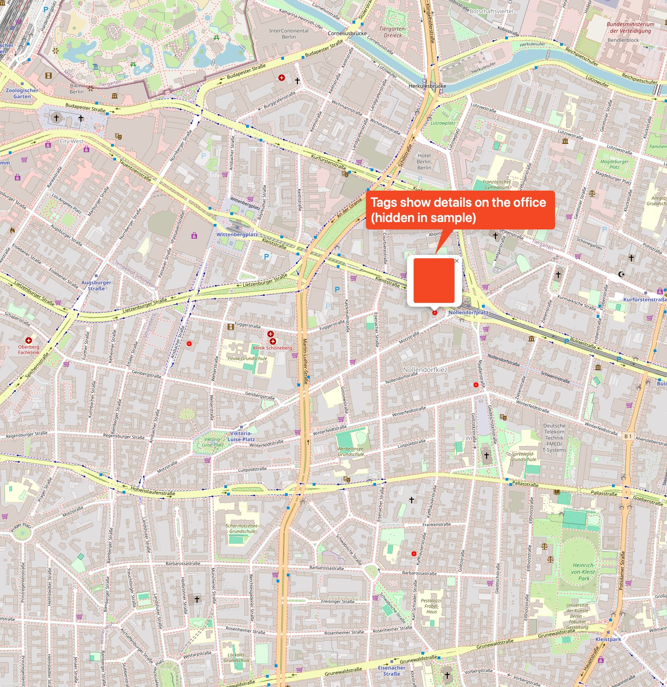

# Mapping Doctors' Offices for 10th Semester Students at Charité

In the 10th semester at Charité, students must select a doctor's office for general medicine.  
Unfortunately, the university only provides a long PDF list of practices. This makes structured analysis and quick geographic orientation difficult.
This repository is a private project (and in no way associated with any institution).

This repository provides two scripts that solve the problem:

## Workflow

1. **Extract structured data from the PDF**

   Use [`extract_doctors_offices_from_pdf.py`](extract_doctors_offices_from_pdf.py) to parse the official PDF list.  
   This script extracts the relevant columns (`Vorname`, `Name`, `Straße`, `PLZ`, `Ort`, …) and creates a clean CSV file.

   ```bash
   python extract_doctors_offices_from_pdf.py
   ```
   Output: aerzte_extracted_structured.csv

2. **Map the offices on an interactive map**
Use map_doctors.py to geocode the addresses and display them on an interactive, zoomable map of Berlin.
```bash
# export your Google Maps API key (or inline when running the script)
export GOOGLE_MAPS_API_KEY="YOUR_KEY_HERE" python map_doctors.py
```
Output: arztpraxen_berlin.html
Open this HTML file in your browser and you can pan, zoom, and click on markers to see the details of each office.

## Example

Here is a screenshot of the resulting interactive map with all Berlin doctors’ offices plotted
(random data on this plot):




In the interacitve map, you can click on the dots representing doctors offices and get the details
(what office, their specific address, the code for choosing the office on the Moses selection
platform).


## Installation
I recommend a virtual environment. Make use of the requirements.txt for creating it.

## Google Maps Embed API
You need a Google Maps Embed API key. Please find documentation on this here: https://developers.google.com/maps/documentation/embed/get-started

## Acknowledgements

This project makes use of several open-source tools and data sources:

- [Camelot](https://camelot-py.readthedocs.io) for PDF table extraction  
- [Pandas](https://pandas.pydata.org/) for data wrangling  
- [Folium](https://python-visualization.github.io/folium/) and [Leaflet.js](https://leafletjs.com/) for interactive maps  
- [OpenStreetMap](https://www.openstreetmap.org/) contributors for map tiles and geographic data  

## License

This project is licensed under the [MIT License](LICENSE).  
You are free to use, modify, and distribute this software for any purpose, with or without attribution, under the simple terms of the MIT license.
